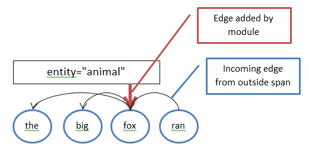

# HeadMarkerModule
This project provides a manipulator to connect span annotations to the syntactic head token covered by the span. Syntactic heads are recognized by having a specific type of incoming pointing relation (typically a dependency edge), whose source comes from a token index outside of the annotated span. The manipulator then adds an edge connecting the span and the head. This can have many useful applications, such as identifying the head word of an NER annotation along with its token annotations (e.g. get POS, lemma and text for the head of an entity annotation). The image below illustrates the added edge.



 This module is implemented for the linguistic converter framework Pepper (see https://u.hu-berlin.de/saltnpepper). A detailed description of the manipulator can be found in [HeadMarker](#details1) or in a [poster](http://dx.doi.org/10.5281/zenodo.15640) presented at the DGfS 2014.

Pepper is a pluggable framework to convert a variety of linguistic formats (like [TigerXML](http://www.ims.uni-stuttgart.de/forschung/ressourcen/werkzeuge/TIGERSearch/doc/html/TigerXML.html), the [EXMARaLDA format](http://www.exmaralda.org/), [PAULA](http://www.sfb632.uni-potsdam.de/paula.html) etc.) into each other. Furthermore Pepper uses Salt (see https://github.com/korpling/salt), the graph-based meta model for linguistic data, which acts as an intermediate model to reduce the number of mappings to be implemented. That means converting data from a format _A_ to format _B_ consists of two steps. First the data is mapped from format _A_ to Salt and second from Salt to format _B_. This detour reduces the number of Pepper modules from _n<sup>2</sup>-n_ (in the case of a direct mapping) to _2n_ to handle a number of n formats.


In Pepper there are three different types of modules:
* importers (to map a format _A_ to a Salt model)
* manipulators (to map a Salt model to a Salt model, e.g. to add additional annotations, to rename things to merge data etc.)
* exporters (to map a Salt model to a format _B_).

For a simple Pepper workflow you need at least one importer and one exporter.

## Requirements
Since the module provided here is a plugin for Pepper, you need an instance of the Pepper framework. If you do not already have a running Pepper instance, click on the link below and download the latest stable version (not a SNAPSHOT):

> Note:
> Pepper is a Java based program, therefore you need to have at least Java 7 (JRE or JDK) on your system. You can download Java from https://www.oracle.com/java/index.html or http://openjdk.java.net/ .


## Install module
If this Pepper module is not yet contained in your Pepper distribution, you can easily install it. Just open a command line and enter one of the following program calls:

**Windows**
```
pepperStart.bat 
```

**Linux/Unix**
```
bash pepperStart.sh 
```

Then type in command *is* and the path from where to install the module:
```
pepper> update de.hu_berlin.german.korpling.saltnpepper::pepperModules-MergingModules::https://korpling.german.hu-berlin.de/maven2/
```

## Usage
To use this module in your Pepper workflow, put the following lines into the workflow description file. Note the fixed order of xml elements in the workflow description file: &lt;importer/>, &lt;manipulator/>, &lt;exporter/>. The HeadMarker is a manipulator module, which can be addressed by one of the following alternatives.
A detailed description of the Pepper workflow can be found on the [Pepper project site](https://u.hu-berlin.de/saltnpepper). 

### a) Identify the module by name

```xml
<manipulator name="HeadMarker"/>
```

### b) Use properties

```xml
<manipulator name="HeadMarker">
  <property key="PROPERTY_NAME">PROPERTY_VALUE</property>
</manipulator>
```

## Contribute
Since this Pepper module is under a free license, please feel free to fork it from github and improve the module. If you even think that others can benefit from your improvements, don't hesitate to make a pull request, so that your changes can be merged.
If you have found any bugs, or have some feature request, please open an issue on github. If you need any help, please write an e-mail to saltnpepper@lists.hu-berlin.de .

## Funders
This project module was developed at Georgetown University. 

## License
  Copyright 2017 Amir Zeldes, Georgetown University.

  Licensed under the Apache License, Version 2.0 (the "License");
  you may not use this file except in compliance with the License.
  You may obtain a copy of the License at
 
  http://www.apache.org/licenses/LICENSE-2.0

  Unless required by applicable law or agreed to in writing, software
  distributed under the License is distributed on an "AS IS" BASIS,
  WITHOUT WARRANTIES OR CONDITIONS OF ANY KIND, either express or implied.
  See the License for the specific language governing permissions and
  limitations under the License.


# <a name="details1">HeadMarker</a>
The HeadMarker adds edges between spans and tokens with an incoming edge from outside the span. The HeadMarker can be integrated in a Pepper workflow as a step of the manipulation phase. 

## Properties
The head marking process can be customized by using the properties listed in the following table. 

|name of property			|possible values		|default value|	
|---------------------------|-----------------------|-------------|
|HeadMarker.spanLayer			    |String	                |''|
|HeadMarker.spanAnnotation			    |String	                |''|
|HeadMarker.edgeType			    |String	                |'dep'|
|HeadMarker.edgeAnnotation			    |String	                |'func'|
|HeadMarker.ignoreEdgeAnnotation			    |String	                |'punct'|
|HeadMarker.headRelType			    |String	                |'head'|
|HeadMarker.headRelLayerName			    |String	                |''|
|HeadMarker.useDominanceRelations				    |true, false			|false|
|HeadMarker.ignoreRoot	            |true, false			|false|

### HeadMarker.spanLayer
Specifies a layer which targeted spans must be in; if not specified, all spans are targeted.

### HeadMarker.spanAnnotation
Specifies an annotation which targeted spans must have; if not specified, all spans are targeted.

### HeadMarker.edgeType
Specifies an edge type for incoming edges identifying the head. (default: dep)

### HeadMarker.edgeAnnotation
Specifies an incoming edge annotation to check for special ignore values, e.g. punctuation. (default: func)

### HeadMarker.ignoreEdgeAnnotation
Specifies annotation values on incoming edges which cause the edge to be ignored, e.g. punctuation. (default: punct)

### HeadMarker.headRelType
Specifies the type to assign to the added edges. (default: head)

### HeadMarker.headRelLayerName
Specifies a layer to give to added edges.

### HeadMarker.useDominanceRelations
Whether to use dominance relations, false by default, then uses pointing relations. (default: false)

### HeadMarker.ignoreRoot
If true, then tokens with no incoming edges inside a targeted span are not considered possible heads (for cases where a root dependency is unmarked) (default: false)


